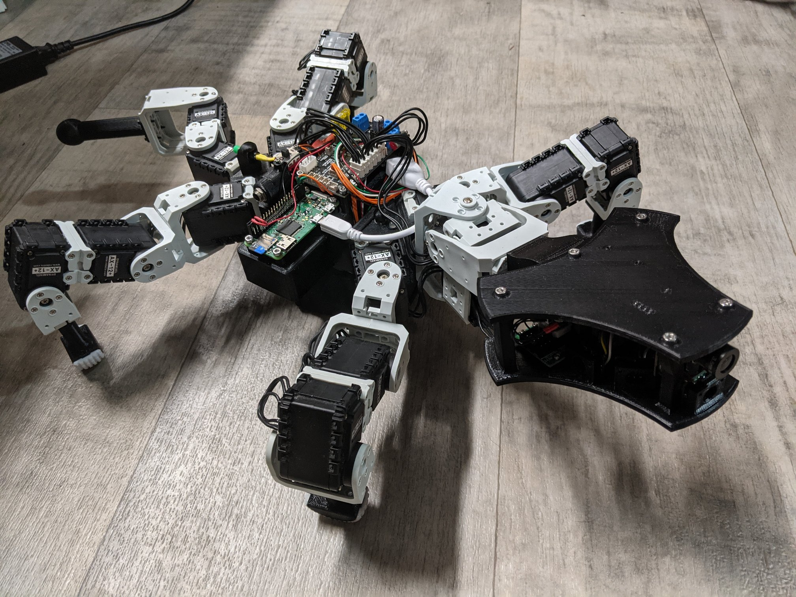

Code in this folder is written in MicroPyton, and runs on an Adafruit STM32F405 Express Feather.

The board is in the head of my quad walking robot Roz:

The code in main.py is split into two main classes, plus some support classes. The first class, BioloidDevice, implements the code needed for the stm32 to sit on the bus, and respond to commands and queries. Notice that this is an incomplete implementation - we don't support everything, but enough to make it work.

The second class, HeadBoard, implements the code that gathers data from the sensors and populates the control table of the BioloidDevice.
