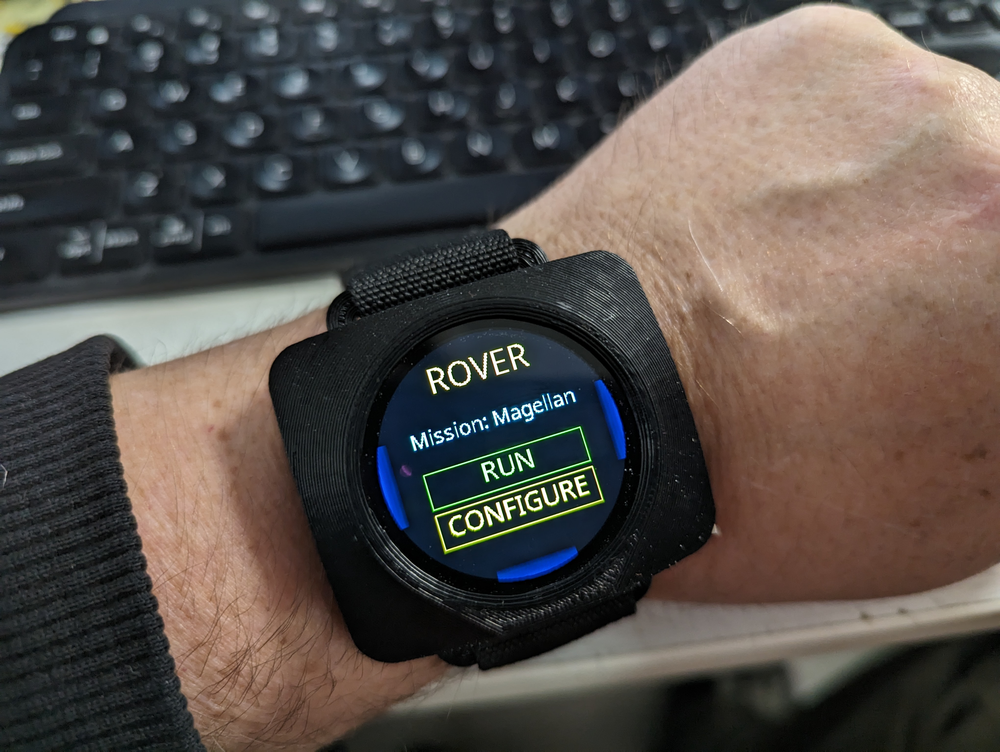
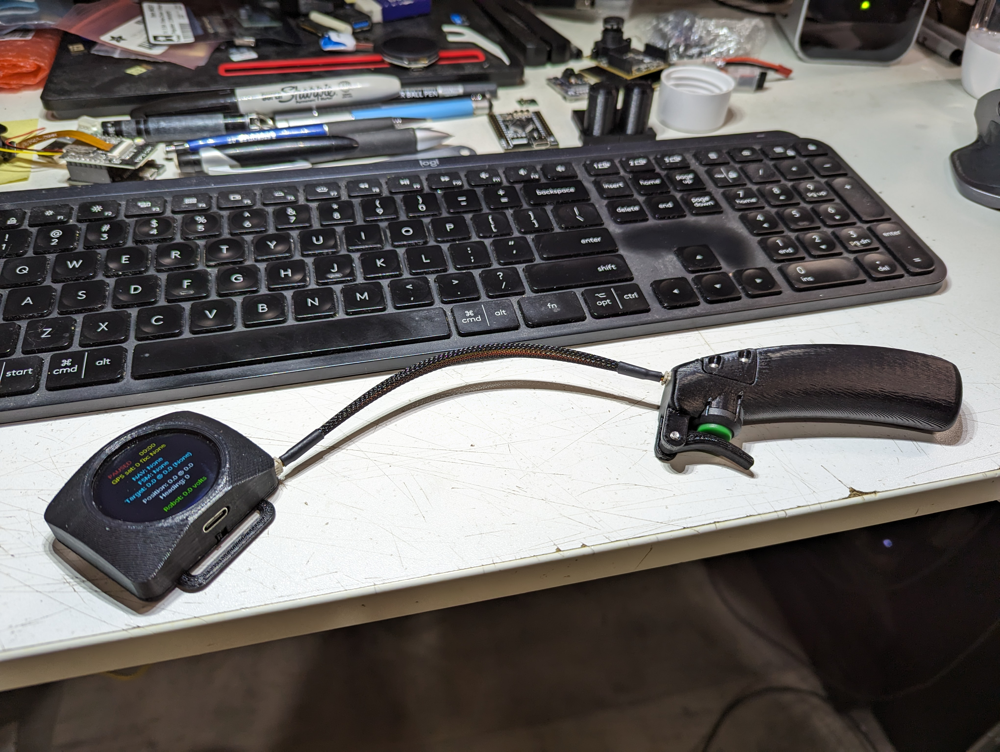
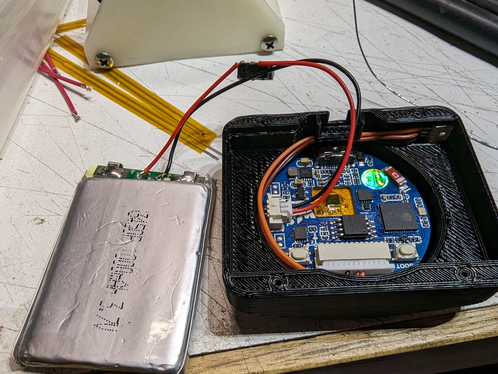
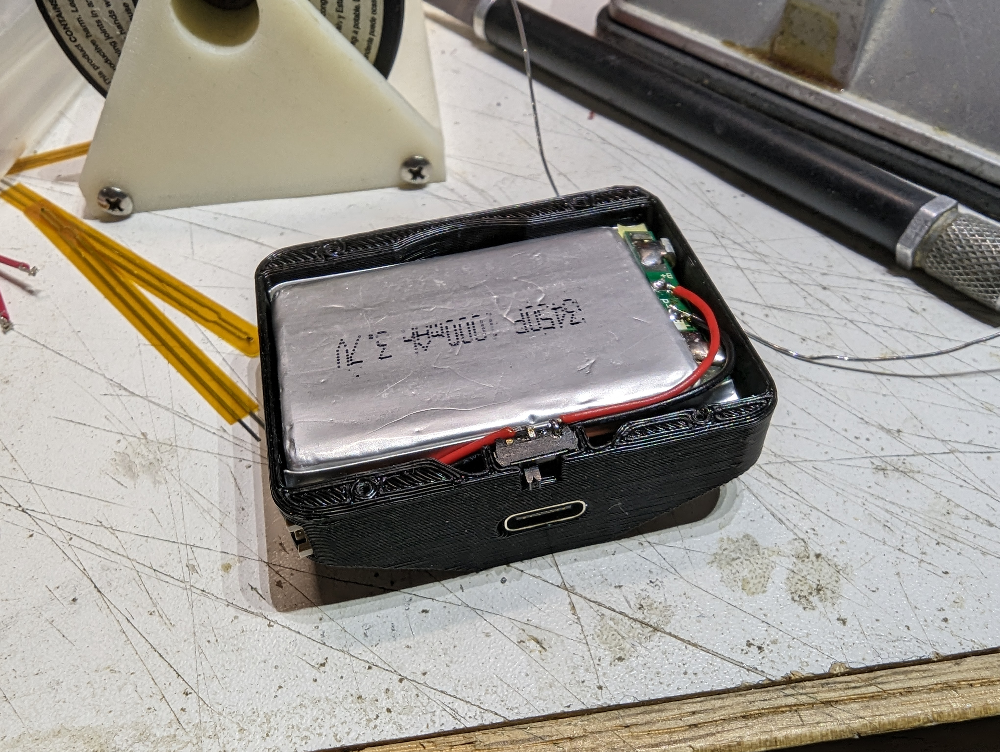

### Universal Robot Configurer

This folder holds the code for my universal robot configurer. It is in a very primitive state right now.

This is a wearable device based on a [Waveshare ESP32-S3 Round Touch LCD](https://www.waveshare.com/esp32-s3-touch-lcd-1.28.htm).

The code allows you to build a complex touch-based windowing system for this device. You can easily create windows with widgets like buttons and labels and lists. You can scroll between sets of windows. I'll be adding a bunch of documentaiton on how to use it, but for now look at main.py, admin.py, and rover.py for an example.

